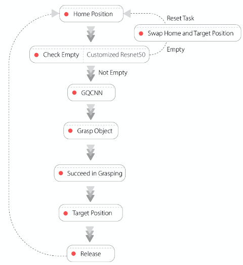
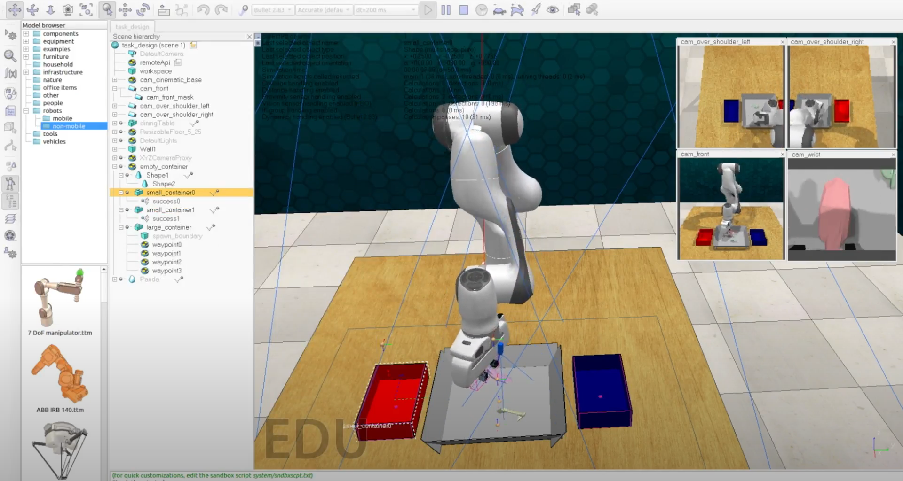

# RLBench Simulation for Autonomous Empty Container

## Description
The goal for this project is to move objects between containers. Specifically, the forward task
is to move objects from the middle container to containers on the side, and the reset task is
to move objects back from the side containers to the middle one. The robot should switch to
the other task when the current container is empty.

## Approach
We implemented the state-machine for both forward and resetting task

1. ResNet-based binary classier is used to check if the container is empty or not
2. GQCNN 2.0 is used to predict the optimal grasping pose
3. RRT is used to plan the trajectory

## Installation

Please use Python 3.6

1. Install [PyRep](https://github.com/stepjam/PyRep)
2. Install [RLBench](https://github.com/stepjam/RLBench)
3. `pip install -r requirements.txt`
4. Install [gqcnn](https://berkeleyautomation.github.io/gqcnn/install/install.html#pip-installation) by `git clone https://github.com/BerkeleyAutomation/gqcnn.git`
5. `cd gqcnn`, `pip install .`
6. Install [perception](https://berkeleyautomation.github.io/perception/install/install.html#installation) by `git clone git@github.com:BerkeleyAutomation/perception.git`
7. `cd perception`, `pip install -e .`

## Example RLBench Usage
Run `python main.py` to launch the script.
Here, the `EmptyContainer` task is used

This script contains code on how to control the robot, get observations, and get noisy object pose readings.

## Demo Video
Please watch the demo video on Youtube

## Useful Files
The following files may be useful to reference from the In the `rlbench` folder in the `RLBench` repo:
* `rlbench/action_modes.py` - Different action modes to control the robot
* `rlbench/backend/observation.py` - All fields available in the observation object
